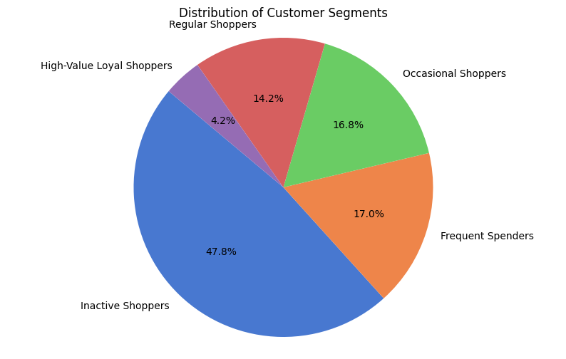

# SmartCRM Customer Segmentation
## Introduction 
SmartCRM uses RFM (Recency, Frequency, Monetary) segmentation to analyze customer behavior and generate actionable insights. By grouping customers into meaningful segments, businesses can implement targeted marketing and personalized strategies.

Recency: How recently a customer made a purchase

Frequency: How often a customer makes purchases

Monetary: How much a customer spends
## Data Collection 
The data is available on [Kaggle](https://www.kaggle.com/datasets/ersany/online-retail-dataset) with an Open Database License (ODbL).

This is a transnational dataset that contains all the transactions occurring between 01/12/2010 and 09/12/2011 for a UK-based and registered non-store online retail. The company mainly sells unique all-occasion gifts. Many customers of the company are wholesalers.
## Data Preparation 
- Calculate Recency, Frequency, and Monetary value for each customer. 
- Perform data cleaning by checking for duplicates, missing values, and dealing with outliers.
- Standardize the data to make it suitable for the machine learning model.
## Data Modeling
- **Principal component analysis (PCA)** is a linear dimensionality reduction technique used to reduce the number of variables of a data set, while preserving as much information as possible. It makes analyzing data points much easier and faster for machine learning algorithms. In this project, we used PCA with 2 dimensions to enhance the effectiveness of our K-Means clustering algorithm, enabling more accurate and efficient segmentation of our customer data.
  
- **K-Means Clustering** is an Unsupervised Learning algorithm, which groups the unlabeled dataset into k-number clusters. It allows us to cluster the data into different groups and a convenient way to discover the categories of groups in the unlabeled dataset on its own without the need for any training.
  
  We first used The **Elbow Method**, which is a graphical method for finding the optimal K value.
  
  
  It revealed that the optimal K=5. After running the model, the following clusters were revealed
  
  

## Cluster Interpretation 
In order to understand the characteristics of each cluster and identify the segment properties, we calculated the mean values for Recency, Frequency, and Monetary for each cluster. Additionally, for more visual interpretation, we visualized the distribution of clusters against each variable. 

- **Cluster 0: **Inactive Shoppers**** Recency: 253.20, Frequency: 1.47, Monetary: 49.19 Customers who haven't been active for an extended period, with no recent purchases.

- **Cluster 1: **Occasional Shoppers**** Recency: 54.58, Frequency: 2.04, Monetary: 39.59 Customers with recent but infrequent purchases and low spending.

- **Cluster 2: **Frequent Spenders**** Recency: 30.66, Frequency: 10.41, Monetary: 406.19 Customers who shop frequently with moderate to High spending. They engage often and spend moderately.

- **Cluster 3: **High-Value Loyal Shopper**** Recency: 19.74, Frequency: 16.10, Monetary: 913.78 VIP Customers who shop very often and spend significantly.They engage frequently and spend generously.

- **Cluster 4 : **Regular Shoppers**** Recency: 29.88, Frequency: 5.72, Monetary: 149.89 Customers who shop regularly, with recent purchases. Moderate frequency and moderate spending.
## Customer Segments
After Identifying the clusters, each customer was assigned its respective segment.These segments are essential  for more effective and targeted marketing strategies tailored to their specific engagement and spending patterns. 

  

